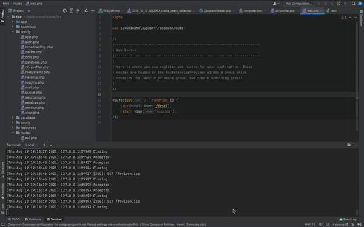
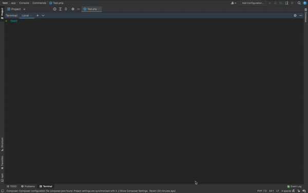

## Usage

1. Install the package via Composer:

    ```shell script
    composer require nguyenhiep/db-profiler
    ```
2. Publish config
    ```shell script
    php artisan vendor:publish --provider="Illuminated\Database\DbProfilerServiceProvider"
    ```
3. Use the `vvv` parameter for Web:

    

4. Use the `-vvv` option for Console:

    

## Local by default

Enabled only for the `local` environment, so you don't have to worry about `production`.

If you want to force profiling for non-local environments - specify it explicitly in your `.env` file:

> DB_PROFILER_FORCE=true

## License

Laravel Database Profiler is open-sourced software licensed under the [MIT license](LICENSE.md).
